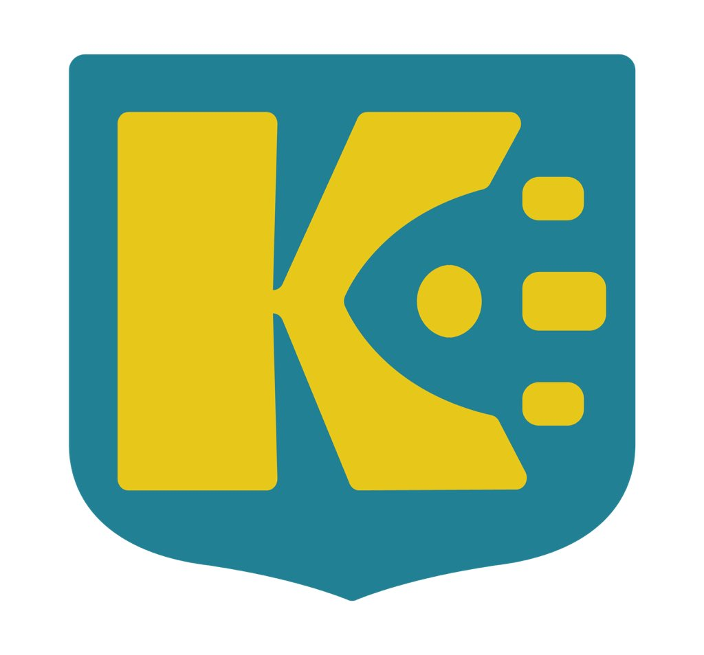
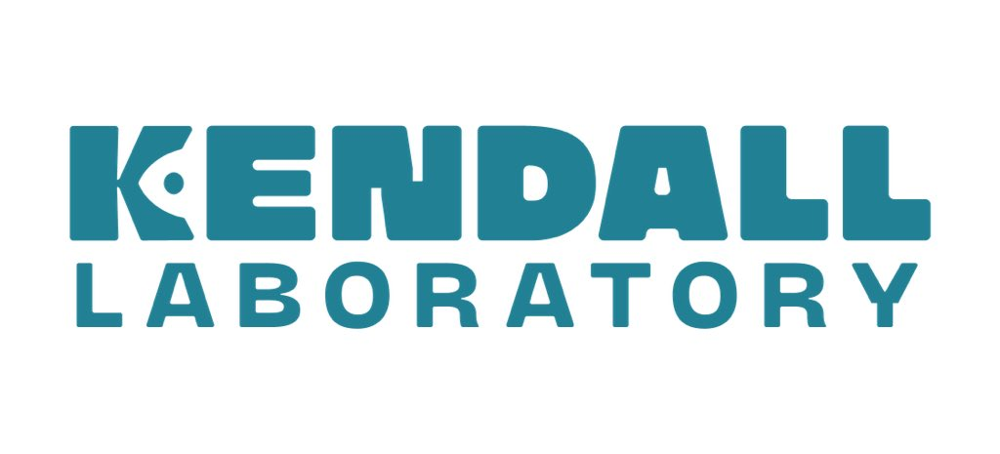

# Analysis for "VGLL2-NCOA2 leverages developmental programs for pediatric sarcomagenesis"

  

  

This is code in support of the manuscript "VGLL2-NCOA2 leverages developmental programs for pediatric sarcomagenesis" by Sarah Watson et al.

https://www.biorxiv.org/content/10.1101/2021.09.15.460544v1.full

## Abstract
Clinical sequencing efforts are rapidly identifying sarcoma gene fusions that lack functional validation. An example is the fusion of transcriptional coactivators, VGLL2-NCOA2, found in infantile rhabdomyosarcoma. To delineate VGLL2-NCOA2 tumorigenic mechanisms and identify therapeutic vulnerabilities, we implemented a cross-species comparative oncology approach with zebrafish, mouse allograft, and patient samples. We found that VGLL2-NCOA2 is sufficient to generate mesenchymal tumors that display features of immature skeletal muscle and recapitulate the human disease. A subset of VGLL2-NCOA2 zebrafish tumors transcriptionally cluster with embryonic somitogenesis and identify VGLL2-NCOA2 developmental programs, including a RAS family GTPase, arf6/ARF6. In VGLL2-NCOA2 zebrafish, mouse, and patient tumors, arf6/ARF6 is highly expressed. ARF6 knockout suppresses VGLL2-NCOA2 oncogenic activity in cell culture, and more broadly, ARF6 is overexpressed in adult and pediatric sarcomas. Our data indicate that VGLL2-NCOA2 is an oncogene which leverages developmental programs for tumorigenesis, and that reactivation or persistence of arf6/ARF6 could represent a therapeutic opportunity.

## Repository purpose
The code is intended as a record of how the analyses were performed and not as a plug-and-play for other users. If you would like to run a similar analysis on your own data, you may find it useful to use this code as a starting point and modify it to suit your needs. Questions on the paper can be directed to Genevieve Kendall and technical questions on the code can be directed to Matt Cannon (matthewvc1@gmail.com).
